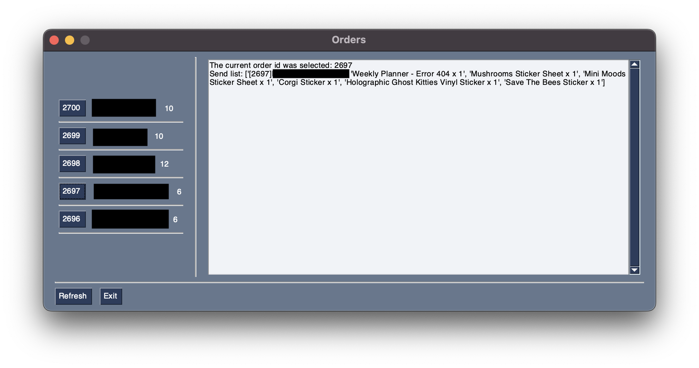
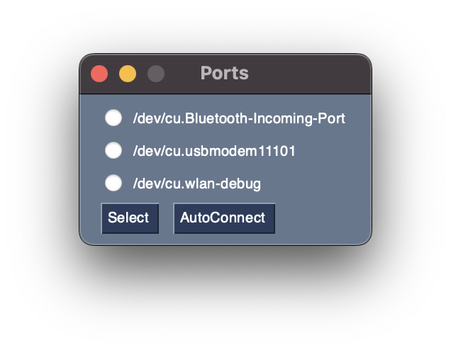

# Packing Printer

---

A GUI based on [PySimpleGui](https://www.pysimplegui.org/en/latest/) designed for printing packing labels. It shows the latest open orders and allows printing their content (product name and quantity). </br> 

It uses a basic thermal printer which supports TTL serial communication (here is an example one -> [Tiny Thermal Receipt Printer](https://www.adafruit.com/product/2751)) alongside with an arduino for connecting and printing on the thermal printer. The main principle is the following:
* The python code sends text which needs to be printed to the Arduino over serial communication
* The arduino receives the text and sends it to the thermal printer
* The thermal printer prints the text
</br></br>
__*Note: the code currently works only with MacOs, as it can't detect the ports on Windows*__

---
## Setup
1. Install the required python packages:
```bash
pip3 install -r requirments.txt
```
2. Upload the arduino code on to the arduino
3. Under `def generate_orders()` enter the link to the website you want to connect to alongside with the consumer key and secret (they can be generated by following the steps [here](https://wedevs.com/docs/dokan/dokan-mobile-app/get-woocommerce-api-key/))

---
## Usage
Run the python script, this will prompt you to select the port where the arduino is connected. If you aren't sure it can automatically detect the port (depending on the number of ports it can take some time) </br>

</br>After that it will show you all open orders, this includes their order number, the name of the customer and the quantity of products they have.